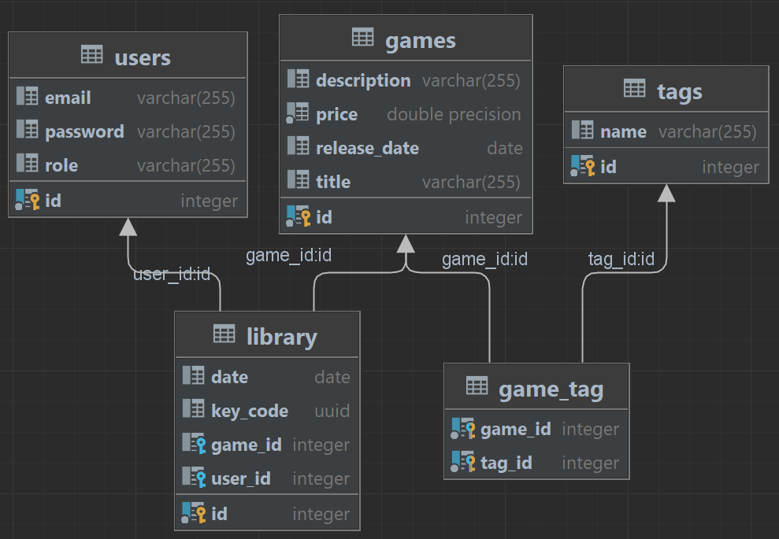

# OnlineStore
This is a REST API with JWT authentication.

### The application includes the following functionality:
- Users system: allows user to create an account and log in.
- Browse games: user can browse games available for purchase.
- Search: users can search games by title and tags.
- Library system: user's games are stored in the library. 
- Admin Panel: admin can add/edit/delete game.

### Database diagram visualization

Database used: H2.

----------------------------

### Endpoints information

| Endpoints                  | Method | Description                             | Request Headers | Request Parameters                     | Request Body                                                                                                                                                                                | Response Body                                            |
|----------------------------|--------|-----------------------------------------|-----------------|----------------------------------------|---------------------------------------------------------------------------------------------------------------------------------------------------------------------------------------------|----------------------------------------------------------|
| /api/auth/authenticate     | POST   | Authenticate user                       | None            | None                                   | { "email": "string",  "password": "string" }                                                                                                                                    | { "status": "string",  "message": "string" } |
| /api/auth/register         | POST   | Register user                           | None            | None                                   | { "email": "string",  "password": "string" }                                                                                                                                    | { "status": "string",  "message": "string" } |
| /api/catalogue/details     | GET    | Get details of a game                   | None            | gameId: Integer                        | None                                                                                                                                                                                        | list: Game                                               |
| /api/catalogue/gameManager | POST   | Add a new game to the store             | Authorization   | None                                   | { "id": 0, "title": "string", "description": "string", "releaseDate": "2023-04-20", "price": 0, "tags": [ { "id": 0, "name": "string" } ] } | message: string                                          |
| /api/catalogue/gameManager | DELETE | Remove a game from the store            | Authorization   | gameId: Integer                        | None                                                                                                                                                                                        | message: string                                          |
| /api/catalogue/gameManager | PUT    | Edit existing game                      | Authorization   | gameId: Integer                        | { "title": "string", "description": "string", "releaseDate": "2023-04-20", "price": 0, "tags": [ { "id": 0, "name": "string" } ] }              | message: string                                          |
| /api/catalogue/games       | GET    | Get all games from the store            | None            | None                                   | { "id": 0, "title": "string", "description": "string", "releaseDate": "2023-04-20", "price": 0, "tags": [ { "id": 0, "name": "string" } ] } | list: Game                                               |
| /api/catalogue/purchase    | POST   | Purchase the game                       | Authorization   | gameId: Integer                        | None                                                                                                                                                                                        | message: string                                          |
| /api/catalogue/search      | GET    | Search games by title and tags          | None            | title: string, tags:array[integer] | None                                                                                                                                                                                        | list: Game                                               |
| /api/library               | GET    | Get all games owned by a user           | Authorization   | None                                   | None                                                                                                                                                                                        | list: Game                                               |
| /api/library/details       | GET    | Get details of the game owned by a user | Authorization   | gameId: Integer                        | None                                                                                                                                                                                        | list: Game                                               |

Authorization requires a JSON Web Token (JWT).
